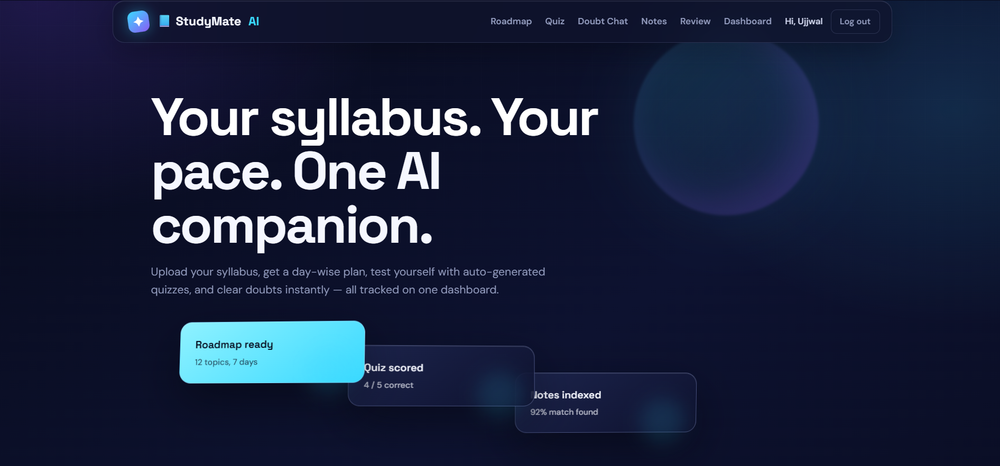
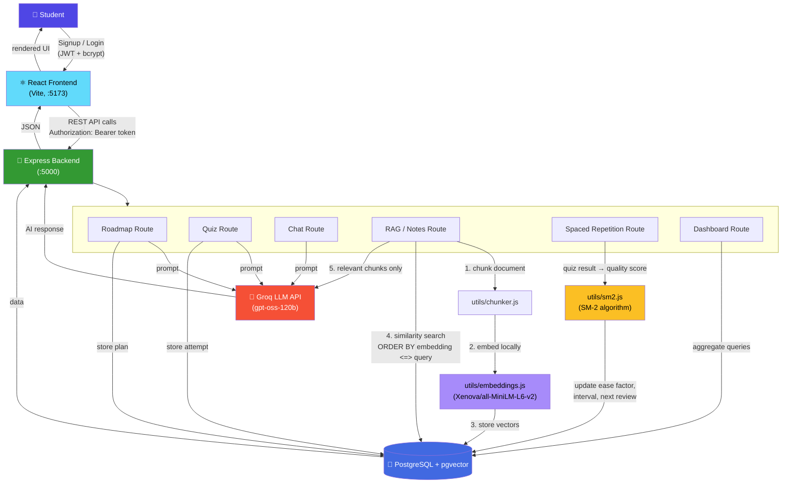
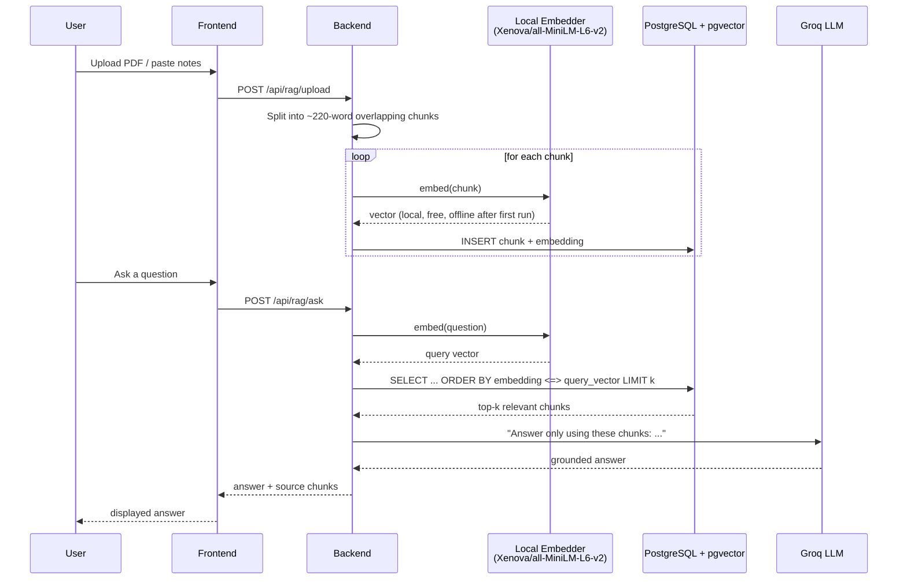

<div align="center">



# 🧠 StudyMate AI

### Your syllabus. Your pace. One AI companion.

**Upload a syllabus → get a day-wise roadmap. Take AI-generated quizzes. Ask questions about your own notes with RAG. Never forget a topic again with spaced repetition.**

[](https://nodejs.org)
[](https://react.dev)
[](https://www.postgresql.org)
[](https://groq.com)
[]()

</div>

---

## 📖 Overview

StudyMate AI is a full-stack, AI-powered study companion built for **DEV2HACK 2026**. It turns a raw syllabus into a personalized, trackable study plan — and backs it up with a real RAG (Retrieval-Augmented Generation) pipeline, an adaptive spaced-repetition engine, and a live progress dashboard, all sitting behind proper authentication.

It isn't a thin wrapper around a chat API — every core feature is backed by a real algorithm or data pipeline:

| Feature | What's actually happening under the hood |
|---|---|
| 🗺️ **Roadmap Generator** | Syllabus text → structured day-wise JSON plan via LLM prompting, stored + tracked per user |
| 📝 **Quiz Generator** | Topic + difficulty → 5 AI-written MCQs with explanations, scored and logged |
| 💬 **Doubt Chatbot** | Topic-scoped conversational context, not a stateless one-shot call |
| 📄 **Ask Your Notes (RAG)** | PDF → chunked → embedded locally (no API cost) → stored as vectors in **pgvector** → cosine-similarity search → only matched chunks are sent to the LLM |
| 🔁 **Spaced Repetition** | Every quiz result feeds the **SM-2 algorithm** (the same scheduling logic behind Anki) to decide exactly when a topic should resurface |
| 📊 **Dashboard** | Live roadmap completion %, quiz history, and average score, computed from real relational data |

---

## 🏗️ Architecture



### RAG pipeline in detail



---

## ✨ Features

- 🔐 **Signup / Login** — bcrypt-hashed passwords, JWT sessions, one-time profile (education level, study goal) collected at signup
- 🗺️ **Roadmap Generator** — paste a syllabus, get a day-wise plan, check off topics as you finish them
- 📝 **Quiz Generator** — pick a topic + difficulty (easy/medium/hard), get 5 AI-written MCQs with explanations
- 💬 **Doubt Chatbot** — topic-scoped chat that remembers recent context
- 📄 **Ask Your Notes (RAG)** — upload a PDF or paste notes; questions are answered *only* from that material using retrieval-augmented generation, not general AI knowledge
- 🔁 **Spaced Repetition Review** — every quiz result feeds the SM-2 algorithm; a Review queue resurfaces topics right when you're about to forget them
- 📊 **Dashboard** — roadmap completion %, quiz history, average score

---

## 🖥️ Tech Stack

| Layer | Technology |
|---|---|
| Frontend | React (Vite) |
| Backend | Node.js, Express |
| Database | PostgreSQL + `pgvector` |
| Auth | JWT, bcryptjs |
| LLM | Groq API (`openai/gpt-oss-120b`) |
| Embeddings | `@xenova/transformers` — local, offline, free |
| Spaced Repetition | Custom SM-2 implementation |

---

## 📁 Project Structure

```
StudyMateAI-MERN/
├── backend/                  Express API (Node.js)
│   ├── server.js
│   ├── db.js                 PostgreSQL connection pool
│   ├── schema.sql            table definitions — run this first (needs pgvector)
│   ├── middleware/auth.js    JWT verification
│   ├── routes/                auth.js, roadmap.js, quiz.js, chat.js,
│   │                           dashboard.js, rag.js, spacedRepetition.js
│   └── utils/                 groq.js (AI calls), store.js (Postgres queries),
│                               embeddings.js (local vector embeddings),
│                               chunker.js (splits documents for RAG),
│                               sm2.js (spaced-repetition scheduling)
└── frontend/                 React app (Vite)
    └── src/
        ├── context/AuthContext.jsx
        ├── pages/             Home, Login, Signup, Roadmap, Quiz, Chat,
        │                       Notes, Review, Dashboard
        └── components/        Navbar, ProtectedRoute
```

---

## 🚀 Getting Started

### 1. Database (PostgreSQL + pgvector)

RAG needs the `pgvector` extension for similarity search.

```bash
# Ubuntu/Debian — match the package to your installed PostgreSQL version
sudo apt install postgresql-16-pgvector

createdb studymate
psql -d studymate -f backend/schema.sql
```

`schema.sql` enables the extension itself (`CREATE EXTENSION IF NOT EXISTS vector;`), so just make sure the extension package above is installed first.

This creates: `users`, `study_data`, `quiz_scores`, `documents`, `document_chunks` (RAG), and `topic_mastery` (spaced repetition).

### 2. Backend

```bash
cd backend
npm install
cp .env.example .env
# fill in:
#   GROQ_API_KEY   — from console.groq.com/keys
#   DATABASE_URL   — your Postgres connection string
#   JWT_SECRET     — any long random string
npm run dev
```

Runs on **http://localhost:5000**.

> **First-run note:** the Notes feature downloads a small embedding model (~90MB, `Xenova/all-MiniLM-L6-v2`) the first time you upload a document or ask a question. Needs internet once — after that it's cached and works fully offline, with no per-request cost.

### 3. Frontend (separate terminal)

```bash
cd frontend
npm install
npm run dev
```

Runs on **http://localhost:5173** and proxies `/api` calls to the backend.

Open **http://localhost:5173**, sign up, and you're in.

---

## 🔍 How It Works (Judge / Interview Q&A)

- **Auth** — signup hashes the password with bcrypt and stores it in `users`; login checks the hash and returns a JWT. The frontend keeps the JWT in `localStorage` and sends it as `Authorization: Bearer <token>` on every request. `middleware/auth.js` verifies it and attaches `req.userId`, which every protected route uses to scope data to that user.
- **Storage** — PostgreSQL. Roadmap and chat history live as JSONB on `study_data` since their shape is naturally nested; quiz attempts are a proper relational table (one row per attempt).
- **AI calls** — every AI route (`roadmap/generate`, `quiz/generate`, `chat`) goes through `utils/groq.js`, which sends a system + user prompt to Groq and asks for structured JSON back.
- **RAG (Ask Your Notes)** — an uploaded PDF/text is split into overlapping ~220-word chunks (`utils/chunker.js`), each chunk is embedded locally (`utils/embeddings.js`, no API cost), and stored in `document_chunks.embedding`, a pgvector column. A question is embedded the same way, then Postgres runs a cosine-similarity search (`ORDER BY embedding <=> query_vector`) to find the most relevant chunks — which are the *only* context handed to the LLM. That retrieval step is what makes it RAG rather than a generic chatbot.
- **Spaced repetition** — `utils/sm2.js` implements the SM-2 algorithm. Every quiz result auto-converts to a 0–5 "quality" score and updates that topic's ease factor, interval, and next review date in `topic_mastery`. The Review page pulls whatever is due today and lets the student rate recall (Again/Hard/Good/Easy), rescheduling the topic again.

---

## 📝 Notes

- Make sure PostgreSQL (with pgvector) is running, the schema is applied, and both backend (`:5000`) and frontend (`:5173`) are running together.
- The app works without a Groq key too — AI features show a clear error until one is added; auth, dashboard, and the review queue work regardless.
- The RAG embedding model needs internet on first use only — after that it's fully local and free.

---

<div align="center">

### Built for DEV2HACK 2026 by Team Vision Coders

**Ujjwal Sharma** (Team Lead) · Aastha · Aanya · Nishita

[](https://linkedin.com/in/your-linkedin-handle)
[](https://github.com/your-username)

*⭐ If this project helped you, consider giving it a star!*

</div>
